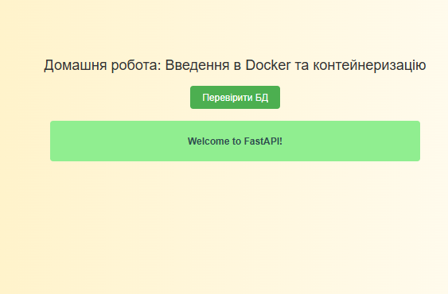

# ДЗ Тема: Основи технології Docker

Необхiдно клонувати FastAPI-застосунок, налаштувати його та запустити в Docker-контейнері. Після цього перевірите правильність роботи застосунку і переконатись в успішному підключенні до бази даних.

Для запуску застосунку виконайте: 

```bash
git clone https://github.com/KryvkoSergii/goit-pythonweb-hw-02.git
docker-compose up
```
Перейдіть за [посиланням](http://localhost:8000)

